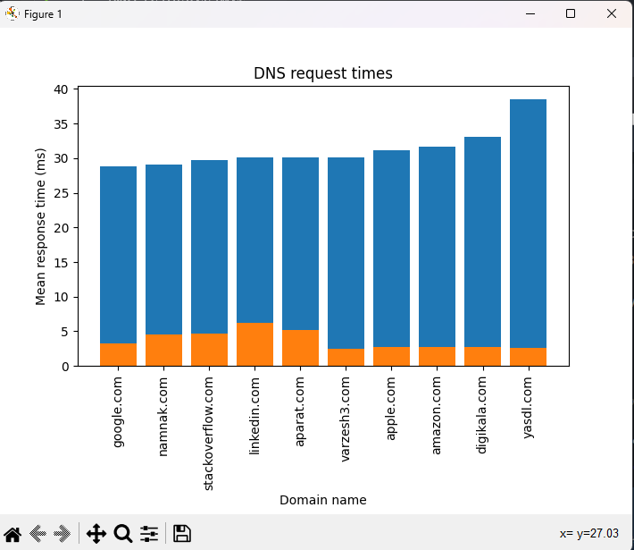
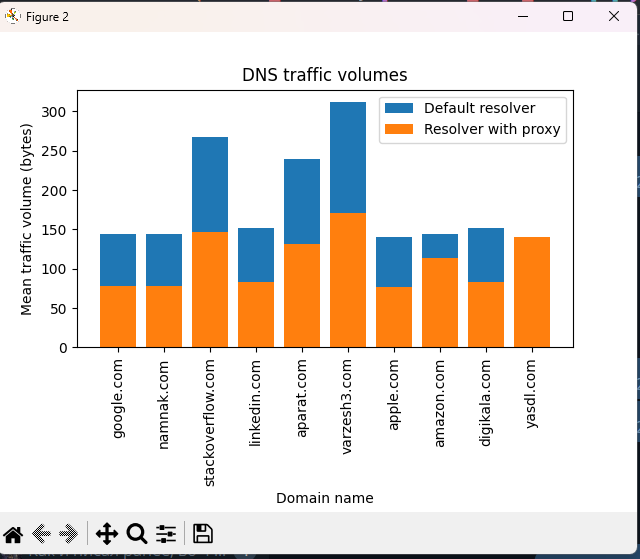

# DNS Proxy Project

This project aims to implement a simple DNS proxy with an internal cache. The DNS proxy will handle users' requests concurrently and analyze them. If the requested domain name's corresponding IP address already exists in the cache, it will be sent directly. Otherwise, the server will request DNS servers (provided in the settings), send the response to the user, and save the answer in the cache.

## Motivation

The motivation behind this project is to create a DNS proxy that improves DNS resolution performance by caching frequently accessed DNS records. By implementing the DNS proxy with an internal cache, we can reduce the response time for DNS queries and enhance the overall efficiency of the DNS resolution process.

## Features

- Concurrently handle users' DNS requests
- Implement an internal cache to store DNS records
- Load settings from a JSON file, including cache expiration time and external DNS servers
- Parse and serialize the application layer of requests and responses without using external libraries
- Respond to DNS requests for types A (ID 1) and AAAA (ID 28) records
- Handle other query types appropriately with a message indicating "Unsupported Query Type"
- Make the cache persistent against program and electricity cut-offs by storing it on disk
- Support connections from various DNS clients, such as nslookup

## Setup and Configuration

1. Clone the repository:
```bash
$ git clone https://github.com/Khalilolgod/DNS_proxy
$ cd DNS_proxy
```
2. Configure the settings:
Edit the `config.json` file located in the project directory. The file should contain the following items:

```json
{
    "cache-expiration-time": 1000,
    "external-dns-servers": [
      "8.8.8.8",
      "8.8.4.4",
      "208.67.222.222",
      "208.67.220.220",
      "1.1.1.1",
      "1.0.0.1",
      "9.9.9.9",
      "149.112.112.112",
      "185.228.168.168",
      "64.6.64.6"
    ]
  }
  ```
  
  # Usage
  In order to run the program execute the following commands in the root directory:
  ```bash
  $ docker-compose up --build
  ```
  
 # Unit Tests
 Also of you want to run the unit tests you can execute the the following command:
 ```bash
 $ python -m unittest discover tests
 ```
 
  # Benchmark
 ```bash
 $ python ./benchmark/benchmark.py
 ```
 # Results
  

 
# contributers
- [Mohammad Shahabadi](https://github.com/MrShadowKiller)
- [Ebrahim Sheikh](https://github.com/Khalilolgod)
  